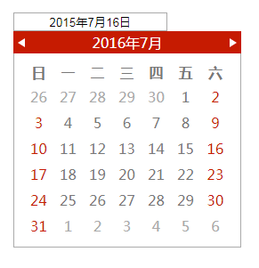
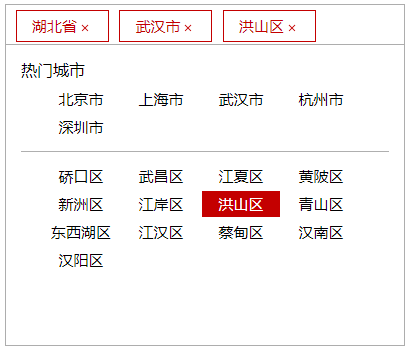

# my-components
开发的组件

## dialog
浮出层组件

## simple-calender
日历组件

## VerticalScroll 
信息向上滚动插件

## fixBox 
根据滚动展示隐藏节点

## jq.address
地址插件

## jq制作滚动条
信息详见博客
[jq制作滚动条](https://emloxe.github.io/2017/05/04/jq%E5%88%B6%E4%BD%9C%E6%BB%9A%E5%8A%A8%E6%9D%A1/)
